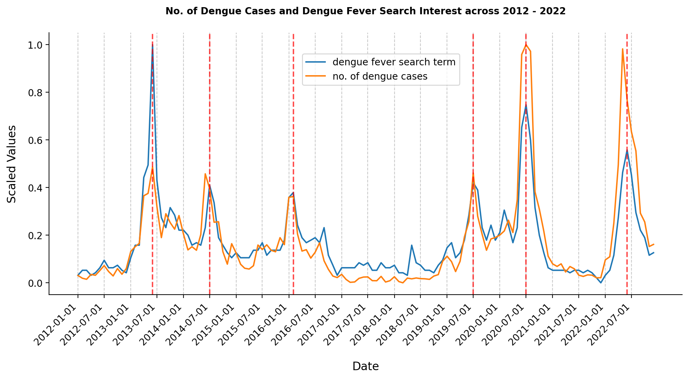
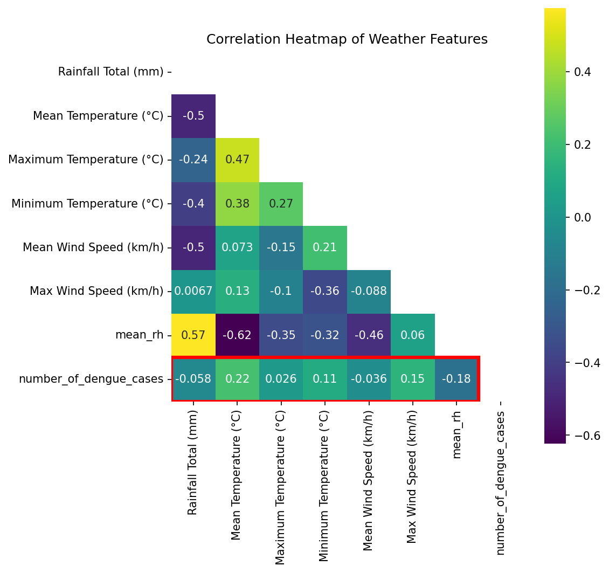

#  Project 4: Predicting Dengue Cases in Singapore

## Problem Statement

The National Environment Agency (NEA) of Singapore has tasked our group of data scientists with developing a machine learning model to accurately predict dengue cases in Singapore. This is important as dengue fever is a significant public health concern in Singapore, with [periodic outbreaks](https://www.ncbi.nlm.nih.gov/pmc/articles/PMC6085773/#:~:text=In%20Singapore%2C%20dengue%20is%20endemic,conditions%20required%20for%20virus%20transmission.) causing a substantial burden on [healthcare resources](https://journals.plos.org/globalpublichealth/article?id=10.1371/journal.pgph.0000024) and impacting the [well-being of the population](https://www.ncbi.nlm.nih.gov/pmc/articles/PMC6519799/). 

The primary objective of this project is to create a machine learning model capable of forecasting the number of dengue cases in Singapore. To achieve this, we will gather data including [weather information](https://www.news-medical.net/news/20220722/Weather-factors-play-a-key-role-in-determining-the-spread-of-dengue-and-other-viral-diseases.aspx#:~:text=Dengue%20fever%20generally%20occurs%20after,one%20to%20two%20months%20later.) and [Google Search terms](https://www.ncbi.nlm.nih.gov/pmc/articles/PMC7414412/) which have been found to have an impact on the number of dengue cases. We will then fit the data to ARIMA models and its variants to identify underlying patterns and make future predictions. The ultimate aim is to present the NEA with the most effective model for deployment. By generating accurate predictions within a specific time horizon, the NEA will be equipped to anticipate potential outbreaks. 

`The selection of the best model will be based on Mean Absolute Percentage (MAPE) score.`

We will also conduct a cost-benefit analysis to quantitatively assess the potential impact of implementing the model on the NEA and other stakeholders involved. This analysis will provide valuable insights into the advantages and benefits associated with deploying the model, aiding in decision-making and resource allocation.

---

### Datasets

The weather datasets and the number of dengue cases were obtained through the government websites, [data.gov.sg](https://data.gov.sg/dataset/weekly-infectious-disease-bulletin-cases) and the [Meteorological Service Singapore](http://www.weather.gov.sg/climate-historical-daily/).

The google trends dataset was obtained from [Google](https://trends.google.com/trends/explore?date=2012-01-01%202022-12-31&geo=SG&q=%2Fm%2F09wsg), and the search terms were decided by our team as we think that these are the common search terms made by individuals who have recently been diagnosed with dengue, or suspect that they are suffering from dengue. 

The datasets were then cleaned and merged together. Some features were feature engineered and added as well. The data dictionary can be found below.

---

### Data Dictionary

|Feature|Type|Description|
|:---|:---|:---| 
|Rainfall Total (mm)|float|total rainfall in a month in mm
|Mean Temperature (°C)|float|the mean temperature for the month
|Maximum Temperature (°C)|float|the maximum temperature for the month
|Minimum Temperature (°C)|float|the minimum temperature for the month
|Mean Wind Speed (km/h)|float|the mean wind speed for the month in km/h
|Max Wind Speed (km/h)|float|the maximum wind speed for the month in km/h
|mean_rh|float|the relative humidity for the month
|search_dengue_fever|int|the level of interest in the particular search term for the month
|search_dengue_hospital|int|the level of interest in the particular search term for the month
|search_dengue_symptoms|int|the level of interest in the particular search term for the month
|search_mosquito_aedes|int|the level of interest in the particular search term for the month
|search_mosquito_bite|int|the level of interest in the particular search term for the month
|search_dengue|int|the level of interest in the particular search term for the month
|search_dengue_fever|int|the level of interest in the particular search term for the month
|search_dengue_treatment|int|the level of interest in the particular search term for the month
|number_of_dengue_cases|int|the number of dengue cases for the month or week depending on the model you're looking at in the notebook
|new_strain|int|binary value of whether a new dengue strain was present during the month
|social_restrictions|int|binary value of whether social restrictions placed during the month
|peak_season|int|June and July of each year were labelled as 1 as it is the dengue peak season of each year

---

### Code Notebooks

The project has been broken down into 3 code notebooks as described below.

Under the `code` folder for this project.
1. `01_GoogleTrends_EDA`: EDA on Google search terms and its impact on dengue cases
1. `02_Weather_EDA`: EDA on weather and its impact on dengue cases
1. `03_Feature_Engineering_and_Model_Fitting`: Feature engineering features, model fitting, selection of best model, cost-benefit analysis, conclusion and recommendations.

### Analysis

The key insights learned from performing EDA on both Google trends and weather information have been summarised below. For a full breakdown, please go through the individual code notebooks.

1. Through the EDA performed on Google trends, we have found that the search terms are a good predictor of dengue cases during the same time period and could be good in predicting dengue cases one month into the future. Anything beyond a month is expected to have poor performance based on its correlation coefficient values that we examined. In the lineplot below of just one of the search terms, you can see that the spikes in search terms coincides very closely with the number of dengue cases, indicating that as the number of dengue cases rise, so does the interest in the search terms we selected.

2. Through the EDA performed on weather information, we found that weather information has very poor correlation with dengue cases, please refer to the heatmap below which shows the poor correlation values. We think that this could be due to Singapore being a country where the weather is stable all year round and not having variations throughout the year and hence it not having an effect as we expected on dengue cases. According to the MSS: [Singapore has a typically tropical climate, with abundant rainfall, high and uniform temperatures, and high humidity all year round. Many of its climate variables, such as temperature and relative humidity, do not show large month-to-month variation.](http://www.weather.gov.sg/climate-climate-of-singapore/) 
We then explored what is causing the spikes in dengue cases if not the weather and found that two main reasons why dengue cases spike in Singapore when they do is due to two things: new strains of dengue, and social restrictions being inplace. **Using this knowledge, we feature engineered two new features called new_strain and social_restrictions** which we believe would improve predictions.

---

### Model Fitting & Results

After performing EDA, we fit the dataset to various types of ARIMA models and its variants (ARIMAX, SARIMAX, etc.) to get predictions.

The summary of models that we fitted is shown below and the **best model is Improved Model #5.**

The best model was chosen based on its MAPE Score.

The best model had a MAPE score of 0.15 which means that the predicted values were off by only 15% compared to the actual values for the predictions period, which in this case is the last 6 months of 2022. This is a huge improvement from the baseline model with a MAPE score of 0.50. It is also important to note that none of the weather information, google trends, or feature engineered features were useful in predicting dengue cases. The best model was trained on just the preceding number of dengue cases without any exogenous features.

We will now perform a cost-benefit analysis for our stakeholder, the NEA to quantify the benefits of this model.

|  | Baseline Model | Improved Model #1 | Improved Model #2 | Improved Model #3 | Improved Model #4 | Improved Model #5 (BEST MODEL) |
|---|---|---|---|---|---|---|
| Model | ARIMA | ARIMAX | SARIMAX | SARIMAX | SARIMAX | SARIMA |
| Training Data | Monthly Dengue Cases from 2012 - 2021 | Monthly Dengue Cases from 2013 - 2021  Including Exogenous Features shifted by a year: 1. Google Trends 2. Weather Information 3. Feature Engineered Features | Monthly Dengue Cases from 2013 - 2021  Including Exogenous Features shifted by a year: 1. Google Trends 2. Weather Information 3. Feature Engineered Features - Insignificant features were removed | Monthly Dengue Cases from 2019 - 2021  Including Exogenous Features shifted by a year: 1. Google Trends 2. Weather Information 3. Feature Engineered Features - Insignificant features were removed  Training Data from a more recent time period | Monthly Dengue Cases from 2013 - 2021  Including Exogenous Features shifted by a year: 1. Google Trends 2. Weather Information 3. More Feature Engineered Features - Insignificant features were removed | Weekly Dengue Cases from 2020 - 2022 Jun |
| Test Data | Entire Year 2022 | Entire Year 2022 | Entire Year 2022 | Entire Year 2022 | Entire Year 2022 | Jul - Dec 2022 (6 months or 26 weeks) |
| MAPE Score | 0.50 | 0.59 | 0.50 | 0.59 | 0.49 | 0.15 |

---
### Cost-Benefit Analysis

We next performed a cost-benefit analysis for our stakeholder, the NEA to quantify the benefits of this model.

To begin this cost-benefit analysis, we first researched how much money NEA spends on just inspections each year.

**Cost Savings:**
1. According to NEA, they performed around [911,000 inspections islandwide in 2022](https://www.nea.gov.sg/media/news/news/index/nea-launches-national-dengue-prevention-campaign-early-urge-vigilance-avert-dengue-outbreak-2023) for any signs of dengue. Each inspection usually takes up to [15 minutes according to an inspector from NEA depending on the layout of the home](https://www.straitstimes.com/singapore/environment/what-to-expect-when-nea-knocks-on-your-door-for-a-dengue-inspection#:~:text=The%20entire%20inspection%20process%20usually,common%20breeding%20spots%20of%20mosquitoes.). To be conservative I will take 10 minutes instead of 15 minutes per inspection. The hourly rate for the inspectors doing the inspection will be on the [extremely conservative end of SGD8.50 per hour](https://www.mycareersfuture.gov.sg/job/environment/temp-management-support-officer-x-100-business-edge-personnel-services-0a908103d7fe557515595ca8d8811ddf) as according to a job post on the government run job portal looking for dengue support officers, the pay listed there is SGD8.50 per hour. However the posting was looking for people to support the actual inspectors, so naturally the inspectors would command a higher hourly pay. I couldn't find any official source regarding the inspection officer's pay so I will stick to using SGD8.50 per hour. 
    1. (911,000 inspections * 10 minutes per inspection) = 9,110,000 minutes
    1. 9,110,000 minutes / 60  = 151833 hours.
    1. **151833 * 8.50 = SGD 1,290,583 spent to do inspections in year 2022.**

With the model we have developed, the NEA can reduce inspections for certain months based on the model's prediction.
For example, if the model predicted the next 6 months to have very low cases of dengue, the NEA could do fewer inspections than they usually do as they can be confident that the number of cases won't be too far off the predicted cases. This is as our model has an MAPE score of 0.15.

**Even with just a 10% reduction in inspections, the NEA could save SGD 129,000 per year.** At the very least, if the NEA doesn't want to reduce spending in combating dengue through reducing inspections, they can reallocate their resources to the months with predicted high number of cases rather than wasting it on months with low cases.

Besides the direct cost savings that NEA can benefit from implementing the model, there are also more potential benefits listed below.

**More Benefits**
1. Timely Campaigns:
The ability to accurately predict dengue cases allows NEA to proactively plan and implement preventive measures. By identifying high-risk periods, NEA can intensify public awareness campaigns such as their National Dengue Prevention Campaign, distribute educational materials, and engage communities in taking preventive actions just before these high-risk period. This proactive approach can lead to reduced dengue transmission, lower healthcare costs, and better overall public health outcomes.

1. Mitigating Economic Impact:
Dengue outbreaks have significant economic consequences due to increased healthcare expenses and productivity losses. It is estimated that the cost of Dengue between the year [2010 - 2020 is  between 1 - 2 billion dollars](https://www.ncbi.nlm.nih.gov/pmc/articles/PMC10021432/#:~:text=We%20estimated%20that%20the%20average,21%2C262%20DALYs%20from%202010%E2%80%932020.). By implementing our model, the NEA can anticipate potential outbreaks and take timely measures to mitigate their impact. These proactive actions can help minimize the economic burden associated with dengue outbreaks.

In conclusion, our dengue cases prediction model, with its MAPE score of 0.15, offers significant cost reductions and other benefits to the NEA. The model enables cost savings through optimized inspection allocation, improves operational efficiency, mitigates the economic impact of outbreaks, and enhances overall resource allocation. By harnessing the power of data-driven predictions, NEA can make informed decisions, allocate resources more effectively, and improve public health outcomes in the fight against dengue.

---
### Conclusions & Recommendations

To conclude, we have achieved our main goal as indicated in the problem statement of creating a machine learning model capable of forecasting the number of dengue cases in Singapore. We developed a model which is able to predict the number of dengue cases across a six month period with a MAPE score of 0.15. We have also conducted a cost-benefit analysis and quantified the benefits which implementing our model will bring.

Recommendations for future work is as follows:
1. We can add a feature related to social responsibility, such as the number of households or businesses [fined for being dengue breeding grounds](https://www.nea.gov.sg/dengue-zika/inspecting-your-homes-and-premises-for-mosquito-habitats#:~:text=If%20your%20premises%20are%20found,and%20Pesticides%20Act%20(CVPA).). This can be a valuable addition for future models as this feature captures an aspect of community engagement and compliance with dengue prevention measures, which can have a significant impact on the overall dengue transmission dynamics. 

1. We can also include more granular location data and consider developing a model which will give predictions for multiple areas across Singapore. This is as the current dataset is information across the whole of Singapore, and the predicted dengue cases are also across the whole of Singapore. With this suggested model, it would be able to predict the number of dengue cases across different areas of Singapore, which would be useful for the NEA to know the exact dengue hotspots to focus their efforts on rather than a blanket approach which may not be as effective..
    1. An example of the kind of data which should be included in future models would be the sites where [Project Wolbachia,](https://www.nea.gov.sg/corporate-functions/resources/research/wolbachia-aedes-mosquito-suppression-strategy/frequently-asked-questions#:~:text=Project%20Wolbachia%20%E2%80%93%20Singapore%20suppresses%20urban,aegypti%20mosquitoes%20do%20not%20hatch.) which is NEA's Mosquito Suppression Strategy have been implemented. This is as their data has shown that in the areas which have implemented this project for more than a year, there have been up to an [88 percent decrease in the number of dengue case.](https://www.nea.gov.sg/media/news/news/index/nea-s-project-wolbachia-singapore-to-be-expanded-to-eight-additional-sites#:~:text=The%20eight%20locations%20are%20Bedok,Multi%2Dsite%20Field%20Study) Meaning that if a particular area is a Project Wolbachia site, the number of dengue cases there is expected to be much lower compared to areas where the project is not present.