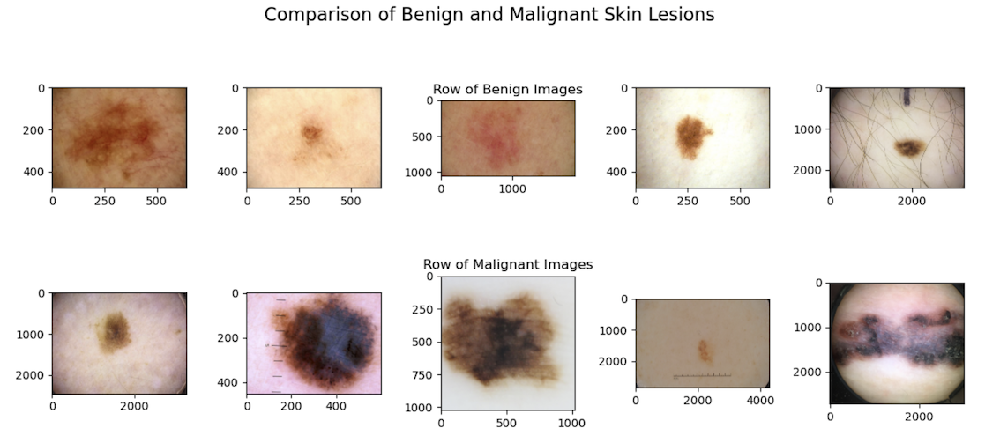

# Skin Lesion Classifier

## Problem Statement

Skin cancer, particularly malignant melanoma, is a [public health concern globally, with over 325,000 cases and over 57,000 deaths due to melanoma in 2020.](https://www.ncbi.nlm.nih.gov/pmc/articles/PMC8968696/#:~:text=Meaning,disproportionate%20mortality%20in%20transitioning%20countries.)

Early detection plays a crucial role in improving treatment outcomes and [reducing mortality rates associated with melanoma.](https://www.cancer.org/cancer/types/melanoma-skin-cancer/detection-diagnosis-staging/detection.html) The American Cancer Society recommends that people [perform skin self-exams once a month](https://www.cancer.org/cancer/types/melanoma-skin-cancer/detection-diagnosis-staging/detection.html) to check for melanoma, and to visit a doctor when new spots on the skin are found. 

However, differentiating between melanoma and benign skin lesions are [difficult even for clinicians](https://www.isic-archive.com/#!/topWithHeader/tightContentTop/about/aboutIsicBackground). Accessing specialized dermatological services for timely evaluation of skin lesions can also be challenging for the general public for various reasons, especially in remote or underserved areas. 

This often leads to delays in diagnosis and treatment, impacting [patient prognosis negatively](https://www.oncologynurseadvisor.com/home/cancer-types/melanoma/delaying-treatment-melanoma-mortality-risk-treatment/#:~:text=A%20population%2Dbased%20study%20found,associated%20with%20worse%20mortality%20outcomes.) and increasing [healthcare costs.](https://www.ncbi.nlm.nih.gov/pmc/articles/PMC4495902/) Finally, if they do visit a doctor, and it turns out to be a false alarm, they would have wasted financial resources on consultation which may be costly. These are all problems which can be solved by what this project aims to produce.

### Objective

The objective of this project is to develop and deploy a highly accurate neural network model for the identification of benign and malignant skin lesions which will then be deployed to an app for usage by the general public. They would then be able to take a photo with their smartphones of any skin lesions to see if a doctor's visit is truly warranted based on the model rather than their own untrained judgement in detecting melanoma. By providing a reliable and accessible tool to the public for skin lesion assessment, it would help address the global burden of skin cancer, and contribute to improved healthcare outcomes worldwide.

`The model's performance will be evaluated based on its recall score.`

### Approach

1. Obtain image data on skin lesions that have been labelled as benign or malignant.
2. Use Transfer Learning as a starting point to train a neural network specialised for this task of classifying skin lesions.
3. Model deployment via Streamlit

---

## Datasets

1. The data for this project was obtained from the International Skin Imaging Collaboration (ISIC) which in their own words is ['an academia and industry partnership designed to facilitate the application of digital skin imaging to help reduce melanoma mortality'](https://www.isic-archive.com/#!/topWithHeader/tightContentTop/about/aboutIsicOverview). 

1. Their database contains over 70,000 images of skin lesions which have been contributed by [various medical universities and cancer centers](https://www.isic-archive.com/#!/topWithHeader/tightContentTop/about/isicArchiveContent). These images of skin lesions have been classified with [ground-truth diagnoses](https://www.isic-archive.com/#!/topWithHeader/tightContentTop/about/isicArchiveGoals) of whether it is benign or malignant.

1. [The images were downloaded through their API.](https://api.isic-archive.com/api/docs/swagger/) 

1. Out of these 70,000 images, I downloaded all images classified as malignant melanoma skin lesions which amounted to **6680**.

1. I downloaded 7500 images of benign skin lesions to get a relatively balanced dataset.

1. This gave me my relatively balanced dataset of 6680 images malignant melanoma and 7500 images of benign skin lesions which I will use to train my neural network.

### Caveat of the Dataset

The dataset used for training the neural network primarily comprises images of individuals with lighter skin tones, which introduces important considerations for stakeholders of this project. It is essential to acknowledge that the performance of the trained model on darker skin tones may present uncertainties.

The overrepresentation of lighter skin tones in the dataset can be attributed to the fact that melanoma is significantly more prevalent in individuals of white ethnicity compared to people of color, with a reported incidence rate [that is 20 times higher](https://www.medicalnewstoday.com/articles/skin-cancer-by-race#survival-rates). Consequently, the availability of a larger number of melanoma images on lighter skin tones might be a reflection of this higher incidence rate.

These observations underscore the need for cautious interpretation and generalization of the model's performance across different skin tones. 

### Splitting the Data

1. After acquiring the data, I split it into training, validation, and holdout set in the following ratio (70% training, 20% validation, 10% holdout)

1. I also split the data into its relevant folders(i.e. training, validation, or holdout folder), and within each folder, there are 2 folders which represent the class of the images inside the folder (i.e. benign folder with benign skin lesions inside it and malignant folder with malignant melanoma images inside it. These folders can be found under the `data` folder.

---

## Code Notebooks

The project has been broken down into 2 code notebooks as described below.

Under the `code` folder for this project.
1. `01_EDA_Modelling`: EDA and the entire modelling process.
1. `02_Model_Deployment`: Code for model deployment on streamlit

---

## EDA

The main takeaway from the EDA is that a neural network would be suitable in differentiating between benign skin lesions and malignant melanoma, much more so than to an untrained eye.

From the images below, we can see that the benign and the malignant melanoma skin lesions are visually a little different according to the [ABCDE criteria which is a guideline created by medical professionals to differentiate skin lesions,](https://ololrmc.com/blogs/moles-when-should-i-worry#:~:text=Benign%20moles%20typically%20have%20a,get%20your%20mole%20checked%20out.&text=Benign%20moles%20are%20usually%20one%20uniform%20color%20throughout.) but it is also understandable how the public may have difficulties in identifying it on their own.

1. For example, the malignant images do have irregular borders especially the image in the 2nd row, 5th column. However, there are images of benign lesions which are also asymmetrical.

**This is a good sign that a neural network model will be able to pick up on these hard to identify differences which the untrained eye may not be able to.**

I also calculated the color channel intensity across each class of skin lesion which resulted in the plot below.

From the plot, we can see that there is indeed a difference between the color channel intensities of the red and green layer between the two classes. This is a good sign that a neural network will be able to pick up on these differences, again something that the untrained eye won't be able to do through visual inspection alone and that model performance should be good.

---

## Modelling Process

For the modelling process, I first started with a baseline model before making changes to try and improve model performance. I will be walking through this process. 

However, a summary can be found below if you don't want to read the step by step process for each model. The conclusion of the modelling process was that all the improved models were not as good as the baseline model. This could be due to the fact that the pre-trained model may already have sufficient complexity and capacity to capture the necessary features and patterns in my skin lesions dataset.

As such, the final model was the baseline model but with one dropout layer before the output layer to reduce overfitting.

<table><thead><tr><th colspan="7">Note: For a full breakdown on the hyperparameters for each model (number of epochs, batch size, type of global pooling layer, etc.), as well as the specific differences between each model, please view the code notebook.</th></tr></thead><tbody><tr><td>Model</td><td>Baseline Model - MobileNetV3</td><td>Improved Model #1</td><td>Improved Model #2</td><td>Improved Model #3</td><td>Improved Model #4</td><td>Final Model</td></tr><tr><td>Main Difference from previous model</td><td>Pre-trained model straight to  output layer</td><td>Global Max Pooling instead of Global Average Pooling</td><td>Increasing number of hidden layers</td><td>Even more hidden  layers</td><td>Augmentation of Images </td><td>Pre-trained model  with dropout layer  included</td></tr><tr><td>Train Recall Score</td><td>0.87</td><td>0.87</td><td>0.85</td><td>0.85</td><td>0.83</td><td>0.85</td></tr><tr><td>Validation Recall Score</td><td>0.81</td><td>0.73</td><td>0.77</td><td>0.76</td><td>0.69</td><td>0.84</td></tr><tr><td>Holdout Recall Score</td><td>n.a</td><td>n.a</td><td>n.a</td><td>n.a</td><td>n.a</td><td>0.96</td></tr></tbody></table>

### Modelling Process - Detailed

1. **To begin my modelling process. I first identified two pre-trained models which were both state-of-the-art, and had a good balance between accuracy and model size.**
    1. Thus, I identified MobileNetv3 and EfficientNetB3 as the pre-trained models I would use for this project.
    1. MobileNetV3 has been shown to give [SOTA results in major computer vision problems.](https://towardsdatascience.com/everything-you-need-to-know-about-mobilenetv3-and-its-comparison-with-previous-versions-a5d5e5a6eeaa)
    1. EfficientNet models are a family of models developed by Google which achieved [SOTA accuracy on multiple datasets](https://ai.googleblog.com/2019/05/efficientnet-improving-accuracy-and.html). As to why B3 specifically, and not B4 or B2. I believe B3 balances model complexity and accuracy the best for my project. [For example B3 has 12.3 million parameters compared to 19.5 parameters in B4 but only having a 0.7% increase in Top-5 accuracy on the ImageNet validation dataset.](https://keras.io/api/applications/) As such, I will use the B3 version of the EfficientNet models.

1. **After trying both pre-trained models, I  decided to use MobileNetV3 as the pre-trained model. I selected it based on the following reasons:**
    1. The mean recall score for MobileNetV3 is better than EfficientNetB3.
    1. The time taken to train the MobileNetV3 was significantly quicker due to it being a less complex model with less parameters.
    1. In the context of my problem statement which aims to deploy this model, having a model which is less computationally intensive is a positive. Having a less complex model also helps to reduce the chances of overfitting which are issues that neural networks constantly run into.
   1. For these reasons, I will be choose MobileNetV3 as the pre-trained model for future improvements.

1. **Improved Model #1 - Global Pooling Layer**
    1. With the pre-trained model identified, I then tried changing the Global Pooling Layer from Global Average Pooling to Global Max Pooling to see if it improved model performance.
    1. Global Average Pooling had better performance than Global Max Pooling.

**`Please note that from this point on, each model builds on the previous model. (i.e. they were all using Global Average Pooling, MobileNetV3, and all changes that were implemented in previous models.)`**

1. **Improved Model #2 - Increasing Hidden Layers**
    1. Now that the global pooling layer was decided, I tried to improve model performance by increasing the number of hidden layers. As skin lesions are complex images, introducing more hidden layers should be better able to capture the intricate patterns in the data.
    1. Included dropout layers to mitigate overfitting.
    1. Included batchnormalization layers to improve [learning speed and also to mitigate overfitting.](https://www.baeldung.com/cs/batch-normalization-cnn#:~:text=Batch%20Norm%20is%20a%20normalization,learning%20rates%2C%20making%20learning%20easier.&text=the%20standard%20deviation%20of%20the%20neurons'%20output.)
    1. Included earlystopping in this model and all future models, to save time on training.
    1. Trained the model for longer epochs to try and improve model performance.

1. **Improved Model #3 - Increasing Hidden Layers Further**
    1. Included even more hidden layers
    
1. **Improved Model #4 - Data Augmentation**
    1. Image data was augmented (e.g. zoomed in, rotated, shifted, etc.) as it has been shown that [data augmentation helps improve model performance.](http://vision.stanford.edu/teaching/cs231n/reports/2017/pdfs/300.pdf)
    1. Also included a learning rate schedule to reduce the learning rate by a factor of 10 from the 5th epoch onwards.
    1. A example of how image could be augmented is shown below. It shows one original image augmented in many different ways. The neural network was then trained on these augmented images.

1. **Final Model**
    1. After trying all of these various improvements:
        1. Different pre-trained models
        1. Global Max Pooling vs Global Average Pooling
        1. Increasing Hidden Layers
        1. Increasing Hidden Layers Further
        1. Augmented Images with Increased Hidden Layers
    1. The best model that I had so far is actually the baseline model using MobileNetV3. This could be due to the fact that the pre-trained model may already have sufficient complexity and capacity to capture the necessary features and patterns in my skin lesions dataset. 
    1. As such the final model, was the baseline model but with one dropout layer before the output layer to reduce overfitting. It was also trained on more epochs, and also had early stopping and learning rate scheduler callbacks.

## Final Model Performance

With my final model trained, I then tested it on the holdout dataset to see how the trained model does on unseen data.

   
The final model had a good recall score of 0.96 and as well as a good precision score of 0.92, as shown above in the confusion matrix and the classification report.

## Model Deployment

The final model was deployed using streamlit. The code notebook for the model deployment can be found in the `code` folder, and the app can be found below.

## Conclusion

In this project, I aimed to develop and deploy a highly accurate neural network model for the identification of benign and malignant skin lesions, with the ultimate goal of providing a reliable and accessible tool to the general public for skin lesion assessment. By leveraging machine learning techniques, we aimed to address the global burden of skin cancer, improve early detection, and contribute to improved healthcare outcomes worldwide.

The final model achieved a recall score of 0.96, indicating its high ability to identify malignant skin lesions correctly. This performance metric is crucial for our problem statement, as the priority lies in correctly identifying as many actual positives (malignant cases) as possible to ensure timely medical attention and reduce mortality rates associated with melanoma.
The model's high recall score demonstrates its effectiveness in distinguishing between benign and malignant skin lesions, offering a valuable tool for the general public. With the integration of this model into a user-friendly smartphone app, individuals can now capture images of skin lesions and assess the need for a doctor's visit based on the model's predictions rather than relying solely on their own untrained judgment. This empowers users to seek medical attention promptly when necessary, potentially improving treatment outcomes and reducing healthcare costs associated with delayed diagnosis.

As such, the objective of this project has been achieved.

## Recommendations for Future Works

As to how future works can be improved, I have the following suggestions:

1. More image preprocessing can be done. Such as standardising the brightness across the images, contrast adjustment, or even removing the hairs from the images which block the important part of the image which is the skin lesion.

2. More advanced pre-trained models could be used instead of MobileNetV3. As I chose MobileNetV3 partly due to the fact that I did not have a lot of computational power to work with and as such had to choose a model which I could run. Future works could work with more complicated models such as EfficietNetV2L which has over 119 million parameters and achieved the [best accuracy score out of all Keras applications so far.](https://keras.io/api/applications/)

3. Obtaining and incorporating diverse datasets that encompass a broader range of skin tones in order to improve the model's robustness and fairness in real-world applications. As previously discussed, the current model was trained predominantly of skin lesions on white skin, future models should be trained on a more diverse dataset consisting of various skin tones.