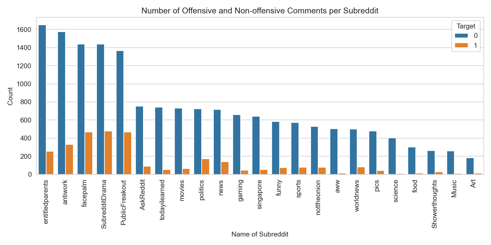
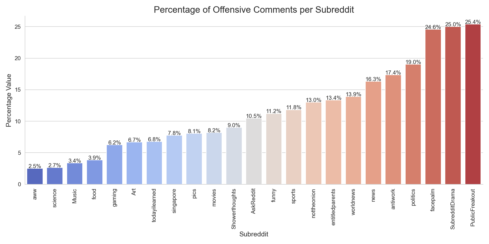
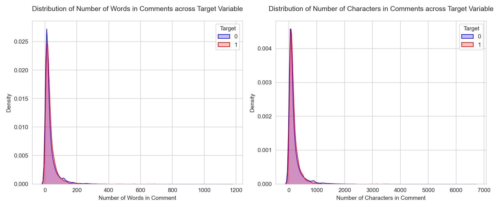

#  Project 3: Web APIs & NLP

## Problem Statement

The aim of this project is to develop a machine learning model that can accurately identify offensive comments on an online message board that a university in Singapore is planning to launch. The message board is intended to foster a sense of community among students, but the university is concerned about the potential for offensive comments as it may include elements of racism, sexism, or other forms of discrimination. These offensive comments can have far-reaching consequences beyond the message board itself. Negative attention from local media or other stakeholders can damage the university's reputation and put it in a negative spotlight. Hence, they have approached us to solve this issue.

To address this concern, we will collect a dataset of comments from the popular social media platform [Reddit](https://en.wikipedia.org/wiki/Reddit), which is similar to the message board the university plans to implement, and whose [user base largely overlaps with the university's student population](https://www.statista.com/statistics/261766/share-of-us-internet-users-who-use-reddit-by-age-group/). We will use text classification algorithms, specifically Multinomial Naive Bayes and Random Forest, to train and evaluate models on this dataset, with a focus on achieving high recall scores to accurately identify offensive comments.

We will also explore the impact of various pre-processing techniques, such as stopword removal, removing of special characters, and lemmatizing, on model performance. Finally, we will present the best performing model to the university, along with recommendations for implementation and ongoing monitoring of the message board.

Overall, the goal of this project is to provide the university with a tool to identify and address offensive comments on their online message board.

---

### Datasets

The datasets were obtained through webscraping Reddit, using PRAW which stands for Python Reddit API Wrapper. The documentation can be found [here](https://praw.readthedocs.io/en/stable/index.html).

After scraping for the data, the y labels were generated using [Google's Perspective API](https://developers.perspectiveapi.com/s/about-the-api?language=en_US), which is an API that uses machine learning to analyse text and returns a probability that the text is of one of certain attributes such as toxic, insulting, threatening, etc.

As to why this project is necessary if there already exists an API which can identify offensive comments is due to the fact that the university would like full control of the model used. They will not have this control if they are dependant on models owned by others.

The scraping resulted in the datasets included in the `data/outputs` folder. Details shown below.

* `comments_from_reddit_part_1.csv`: The first 6000+ comments scraped from reddit.
* `comments_from_reddit_part_2.csv`: Another 4000+ comments scraped from reddit.
* `comments_from_reddit_part_3.csv`: Another 10000+ comments scraped from reddit, as the first two datasets had extremely imbalanced target classes. This 3rd set generated a slightly more balanced target class.
* `Final_DataFrame_with_ylabels.csv`: The final dataset with all 3 scraped datasets combined.
 
---

### Data Dictionary

|Feature|Type|Description|
|:---|:---|:---| 
|title|str|reddit post where the comment was scraped from
|score|int|the number of upvotes versus downvotes for the post
|subreddit|str|the name of the subreddit the post was scraped from
|id|str|the unique id of the reddit post
|url|str|the url of the reddit post
|num_comments|int|the number of comments the particular post had
|comment|str|a particular comment
|target|int|0 = non-offensive comment, 1 = offensive comment

---

### Code Notebooks

The project has been broken down into 2 code notebooks as described below.

Under the `code` folder for this project.
1. `01_webscraping`: All webscraping and generating of y labels are done in this notebook.
1. `02_eda_preprocessing_modelling`: EDA, baseline model fitting, preprocessing such as lemmatizing, stopword removals, etc. are done in this notebook. Improved models and final model selection are also all done in this notebook.

### Analysis

We first analysed as to whether the topics where the comments were scraped from had an effect on the number of offensive comments.

As shown above, we can see that topics do make a difference in whether there are more offensive comments as subreddits with similar number of comments scraped have visible differences in the number of offensive comments scraped. 

For example politics and movies. The ratio of offensive and non-offensive comments vary visibly. This is to be expected, as politics is usually a topic which people disagree on far more than compared to movies. We investigated further by plotting the percentage of offensive comments per subreddit which will provide specific numbers. 

As shown above, the topic definitely affects the number of offensive comments. This is to be expected as topics like politics generally elicit stronger opinions and consequently offensive comments. In the context of the problem statement, after initial rollout of the model, heavier moderation may be needed for particular topics if the university does intend on creating specific topics such as politics.

We next looked at whether the length of the comment in terms of both words and character had an effect on the comment being offensive. 

From the plots, we can see that the number of words and number of characters in a comment has no effect on the probability of the comment being offensive or not.

This is as the distributions of both target classes in both plots are overlapping, where if there was an effect, their distributions would not be overlapping. It is just as likely for an offensive comment to be long as it is to be short.

---

### Model Fitting & Results

After the EDA, we passed the dataset through a CountVectorizer and fitted it to a Multinomial Naive Bayes model and got the following results from the test set.

<table><thead><tr><th>Model</th><th>Target</th><th>Precision</th><th>Recall</th><th>f1-score</th><th>support</th></tr></thead><tbody><tr><td rowspan="2">Baseline Model (CountVectorizer - Multinomial NB)</td><td>0</td><td>0.91</td><td>0.98</td><td>0.94</td><td>3403</td></tr><tr><td>1</td><td>0.79</td><td>0.43</td><td>0.56</td><td>610</td></tr></tbody></table>

As expected, the performance of the model on comments which have been labelled as 1 or offensive isn't particularly impressive with an f1 score of only 0.56. This was the baseline score for us to improve on in future models. 

We next improved model performance by doing the following steps:
1. Removing special characters
1. Removing stopwords
1. Lemmatizing
1. Tuning the parameters of the vectorizer.

<table><thead><tr><th>Model</th><th>Target</th><th>Precision</th><th>Recall</th><th>f1-score</th><th>support</th></tr></thead><tbody><tr><td rowspan="2">Improved Model (CountVectorizer - MultinomialNB)</td><td>0</td><td>0.94</td><td>0.96</td><td>0.95</td><td>3403</td></tr><tr><td>1</td><td>0.73</td><td>0.64</td><td>0.68</td><td>610</td></tr></tbody></table>

The improved model does perform better compared to the baseline model based on the f1 score for the offensive target label. The f1-score improved from 0.56 to 0.68, and more importantly the recall score for offensive comments improved from 0.43 to 0.64. This means that the lemmatizing, removing stopwords, removing special characters, and tuning the vectorizer parameters did help.

However, we wanted to further improve the model. We knew that the target class labels were imbalanced. So to further improve the model, we downsampled our dataset to have a balanced split of 50/50 between the offensive and non-offensive comments.

We also fitted the dataset to Random Forest models to compare performance. The next table will show the results of these various models and the ones previously seen to have an overview of all the models before we move on to model selection.

<table><thead><tr><th>No.</th><th>Model</th><th>Target</th><th>Precision</th><th>Recall</th><th>f1-score</th><th>support</th></tr></thead><tbody><tr><td rowspan="2">1</td><td rowspan="2">Improved Model (CountVectorizer - MultinomialNB)</td><td>0</td><td>0.94</td><td>0.96</td><td>0.95</td><td>3403</td></tr><tr><td>1</td><td>0.73</td><td>0.64</td><td>0.68</td><td>610</td></tr><tr><td rowspan="2">2</td><td rowspan="2">Downsampled Model (CountVectorizer - MultinomialNB)</td><td>0</td><td>0.88</td><td>0.59</td><td>0.71</td><td>611</td></tr><tr><td>1</td><td>0.69</td><td>0.92</td><td>0.79</td><td>610</td></tr><tr><td rowspan="2">3</td><td rowspan="2">Downsampled Random Forest Model (CountVectorizer - Random Forest)</td><td>0</td><td>0.78</td><td>0.94</td><td>0.85</td><td>611</td></tr><tr><td>1</td><td>0.93</td><td>0.73</td><td>0.82</td><td>610</td></tr><tr><td rowspan="2">4</td><td rowspan="2">Improved Model (TF-IDF Vectorizer - MultinomialNB)</td><td>0</td><td>0.88</td><td>1.00</td><td>0.94</td><td>3403</td></tr><tr><td>1</td><td>0.99</td><td>0.24</td><td>0.39</td><td>610</td></tr><tr><td rowspan="2">5</td><td rowspan="2">Downsampled Model (TF-IDF Vectorizer - MultinomialNB)</td><td>0</td><td>0.84</td><td>0.65</td><td>0.73</td><td>611</td></tr><tr><td>1</td><td>0.71</td><td>0.88</td><td>0.79</td><td>610</td></tr><tr><td rowspan="2">6</td><td rowspan="2">Downsampled Random Forest Model (TF-IDF Vectorizer - Random Forest)</td><td>0</td><td>0.78</td><td>0.94</td><td>0.86</td><td>611</td></tr><tr><td>1</td><td>0.93</td><td>0.74</td><td>0.82</td><td>610</td></tr></tbody></table>

---

### Conclusions & Recommendations

To conclude, in the context of the problem statement, the best model would be model number 2, the Downsampled CountVectorized Multinomial NB model.

This is as the model had the highest recall for the target label 1 or offensive commments, which is what the problem statement seeks to achieve, to identify as many offensive comments as possible. In this regard, the project has succeeded as it produced a model which is able to correctly identify 92% of offensive comments.

The school can now run all student comments through the model to flag out offensive comments before they get posted to the message boards.

Recommendations for the school to further improve on this model are as follows:
1. Once the new message board has been rolled out, they can create topics similar to the concept of subreddits. This will give an additional datapoint for future models to learn from, as can be seen from my EDA that the subreddit the comment was scraped for had an effect on the probability of the comment being offensive. The school can therefore take note of certain topics which are more likely to produce offensive comments.
1. To include other languages as part of the model, as Singapore is a multiracial country, the students will submit comments in other languages as well. Future models will therefore need to be trained in the local languages to identify offensive comments.
